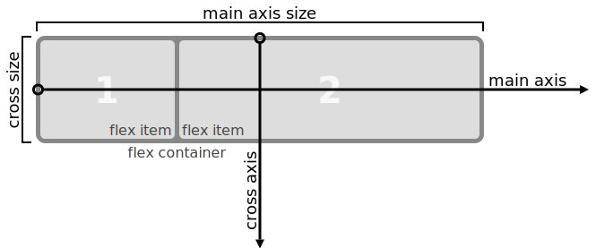

home: index.html
prev: 3-additional.html
next: 5-tricks.html
---

# 4. CSS3: Flexbox

In this chapter, I will cover the flexbox layout mode that was added in CSS3.

The new `display: flex` (flexbox) layout mode is an alternative to the layout modes introduced in CSS 2.1. It has fairly broad support in modern browsers, meaning it even in works in IE10 and above. The unofficial [flexbugs](https://github.com/philipwalton/flexbugs) repository tracks several dozen flexbox bugs across browsers and is a good place to refer to for browser-specific issues.

A persistent problem with CSS layouts is that it is somewhat difficult to control how negative space - the space between actual content - is allocated.
In many cases you cannot force the user to use a particular viewport/display size, nor do you have full control over how many child items need to be shown in a particular section of a web app.

The CSS3 flexbox layout mode is an answer to managing negative space explicitly in CSS. It provides a lot of control over how child items within a flexbox parent should be (re)sized, wrapped and aligned.

The basic assumption built into flexbox is that you as an author want to ensure that the content of the flexbox adjusts appropriately to:

- changes in the flexbox parent's available width and height and
- changes in the number of child items in the flexbox container

The "flex" in flexbox refers to the ability to specify how child items should be sized when the available width or height is either greater than or less than the "ideal" amount needed by the child boxes.

# Flexbox properties

The flexbox properties can be divided into two: properties set on the parent container and properties set on the child boxes.

- flex container properties
  - `display: flex` and `display: inline-flex`
  - `flex-flow` (shorthand property)
    - `flex-direction`: the direction in which the children are stacked
    - `flex-wrap`: whether the flex items can wrap onto multiple flex lines
  - `justify-content`: how the items are positioned on the main axis
  - `align-items`: how the items are positioned relative to their flex lines on the cross axis
  - `align-content`: how the flex lines are positioned relative to the parent on the cross axis

Just looking at those properties you can tell that a flexbox parent resembles a regular paragraph of text (e.g. an inline-level formatting context) to some extent. It has a specific direction in which items are stacked, and items can wrap onto multiple flex lines. It may also remind you of a single row in a table, though table rows do not wrap like flexbox can.

Unlike a regular paragraph or a table row, a flexbox parent can stack items either horizontally (`flex-direction: row`) or vertically (`flex-direction: column`). Further, you have detailed control over the wrapping and relative positioning of the child items and flex lines that was missing from earlier layout modes.

- flex item properties
  - `order`: the relative order of the items
  - `flex` (shorthand property)
    - `flex-grow`: the proportion of space allocated to a child when there is space left over on the main axis
    - `flex-shrink`: the proportion of negative space (shrinkage) allocated to a child when there is not enough space on the main axis
    - `flex-basis`: how the child item's content dimensions affect the `flex-grow` and `flex-shrink` calculations
  - `align-self`: a property that overrides `align-items` for a specific child

Flex items are somewhat reminiscent of inline-block elements: they behave like block-level boxes in that they can have a `width` and a `height`, but can also wrap onto flex lines. The flexbox special sauce related to child items is all about how they behave when they need to adapt to varying container element sizes. The `flex-grow` and `flex-shrink` properties control growth and shrinkage, and `flex-basis` controls how the content dimensions are taken into account, as you will see in a moment.

If there is just one property you need to pay attention to, it's `flex-basis`. It is crucial in both the flex resizing and in determining how flex items are placed on flex lines. I will highlight this property and the four operation modes it enables fairly early on.

## display: flex and anonymous box generation

First, how is the flexbox layout triggered and what elements does it apply to?

The flexbox layout affects every immediate child element of a single parent element. To trigger flexbox layout, set the parent element to `display: flex`. Every child element of that parent will be laid out using flexbox.

Similar to how the block and inline formatting contexts work, every child element of the flex container becomes a flex item; if necessary, anonymous box generation occurs for text content that doesn't have containing element:

> Each in-flow child of a flex container becomes a flex item, and each contiguous run of text that is directly contained inside a flex container is wrapped in an anonymous flex item. However, an anonymous flex item that contains only white space (i.e. characters that can be affected by the white-space property) is not rendered, as if it were display:none. [source](http://www.w3.org/TR/css3-flexbox/#flex-items)

However, absolutely positioned children are excluded.

> An absolutely-positioned child of a flex container does not participate in flex layout. However, it does participate in the reordering step (see order), which has an effect in their painting order. [source](http://www.w3.org/TR/css3-flexbox/#abspos-items)

What does it mean for an in-flow child to become a flex item?

> The `display` value of a flex item is blockified: if the specified display of an in-flow child of an element generating a flex container is an inline-level value, it computes to its block-level equivalent.
>
> Some values of `display` trigger the creation of anonymous boxes around the original box. It’s the outermost box—the direct child of the flex container box—that becomes a flex item. For example, given two contiguous child elements with `display: table-cell`, the anonymous table wrapper box generated around them becomes the flex item.

That is, any `display: inline-*` children are treated as `display: block`, e.g. `display: inline-table` would become `display: table`; the sizing of the flex items is based on the outermost box.

## Flex container properties: main and cross axis

The flexbox parent can lay out its child elements either horizontally or vertically. Since you can switch that direction as you want, the flexbox spec uses the terms [main axis and cross axis](http://www.w3.org/TR/css3-flexbox/#box-model). The direction in which child boxes are stacked is known as the main axis, and the axis perpendicular to the main axis is called the cross axis as shown below:



*The `flex-direction` property* controls the direction of the main axis. The default value is `flex-direction: column`, and the possible values are shown in the example below (rendered with your browser's flexbox implementation):

```inline-snippet
<div class="flex-parent blue">
  <div class="green">a</div><div class="orange">b</div><div class="red">c</div>
</div>
---
.flex-parent {
  display: flex;
  width: 150px;
  height: 150px;
}
---
.flex-dir-row {
  flex-direction: row;
}
.flex-dir-column {
  flex-direction: column;
}
.flex-dir-row-reverse {
  flex-direction: row-reverse;
}
.flex-dir-column-reverse {
  flex-direction: column-reverse;
}
```

The `row` and `column` directions do what you would expect. You can also reverse the relative order of the child items by setting `flex-direction` to `row-reverse` or `column-reverse` (specifically, the main-start and main-end directions are [swapped](http://www.w3.org/TR/css3-flexbox/#flex-direction-property)).

## Flex container properties: flex lines

Like an inline block formatting context, a flexbox container's contents can be laid out on multiple lines.

> Flex items in a flex container are laid out and aligned within *flex lines*, hypothetical containers used for grouping and alignment by the layout algorithm.

The `flex-wrap` property controls whether the child elements are wrapped or whether they overflow.

> A flex container can be either single-line or multi-line, depending on the flex-wrap property:

> - A *single-line* flex container lays out all of its children in a single line, even if that would cause its contents to overflow.

> - A *multi-line* flex container breaks its flex items across multiple lines, similar to how text is broken onto a new line when it gets too wide to fit on the existing line. When additional lines are created, they are stacked in the flex container along the cross axis according to the flex-wrap property. Every line contains at least one flex item, unless the flex container itself is completely empty. [source](http://www.w3.org/TR/2015/WD-css-flexbox-1-20150514/#flex-lines)

| `flex-wrap` value | Description
|-------|----------------------------------------------------------------------
| nowrap | items do not wrap
| wrap | items wrap from left to right
| wrap-reverse | items wrap from right to left

The possible values are shown in the example below for `flex-direction: row`:

```inline-snippet
<div class="flex-parent blue">
  <div class="green">a</div><div class="orange">b</div><div class="red">c</div>
</div>
---
.flex-parent {
  display: flex;
  width: 150px;
  height: 150px;
}
.flex-parent div {
  height: 45px;
  width: 45px;
}
---
.flex-nowrap {
  flex-wrap: nowrap;
}
.flex-wrap {
  flex-wrap: wrap;
}
.flex-wrap-reverse {
  flex-wrap: wrap-reverse;
}
```

The possible values are shown in the example below for `flex-direction: column`:

```inline-snippet
<div class="flex-parent blue">
  <div class="green">a</div><div class="orange">b</div><div class="red">c</div>
</div>
---
.flex-parent {
  display: flex;
  flex-direction: column;
  width: 150px;
  height: 150px;
}
.flex-parent div {
  height: 45px;
  width: 45px;
}
---
.flex-nowrap {
  flex-wrap: nowrap;
}
.flex-wrap {
  flex-wrap: wrap;
}
.flex-wrap-reverse {
  flex-wrap: wrap-reverse;
}
```


## Flex items: flex item sizing

In order to understand how flex items are distributed across the flex lines, we need to know how their size is calculated. [Section 9 of the flexbox spec](http://www.w3.org/TR/css3-flexbox/#layout-algorithm) describes the detailed layout algorithm, but for our purposes it is interesting to note that the positioning is performed in the following order:

1. First, the container's size and the *hypothetical main size* of each flex item is calculated using `flex-basis`.
2. Second, the flex items are assigned to flex lines (if permitted by `flex-wrap`).
3. The final size of each flex item is calculated using `flex-grow` or `flex-shrink`.
4. The flex lines are aligned across the main axis (`justify-content`).
5. The flex items are aligned across the cross axis (`align-items`, `align-content` and `align-self`).

In other words, there are three high level steps that occur in this order:

- *Dividing items onto flex lines*: the hypothetical size of flex items is calculated and based on that size the items are divided on flex lines.
- *Resizing the flex items on each flex line*: for each flex line, the final size of each flex item is calculated.
- *Aligning lines and items*: alignment is applied across the flex lines and then the flex items.

I will discuss these steps in order, but first, I have to start the discussion by talking about `flex-basis`.

### flex-basis

`flex-basis` is the linchpin to understanding how the flexbox layout calculations work. It is a crucial property because it affects both how flex items are split onto lines as well as the flex calculations that occur afterwards.

The `flex-basis` property is set on the flex items (it can be inherited from the parent as well if you need a default value). The valid values are:

> - *auto*: When specified on a flex item, the auto keyword retrieves the value of the main size property as the used flex-basis. If that value is also auto, then the used value is content.
> - *content*: Indicates automatic sizing, based on the flex item’s content.
> - *width*: For all other values, flex-basis is resolved the same way as width in horizontal writing modes: percentage values of flex-basis are resolved against the flex item’s containing block, i.e. its flex container, and if that containing block’s size is indefinite, the result is the same as a main size of auto. Similarly, flex-basis determines the size of the content box, unless otherwise specified such as by box-sizing. [source](http://www.w3.org/TR/2015/WD-css-flexbox-1-20150514/#flex-basis-property)

As the spec states, the `flex-basis` ...

> specifies the flex basis: the initial main size of the flex item, before free space is distributed according to the flex factors. [source](http://www.w3.org/TR/2015/WD-css-flexbox-1-20150514/#flex-basis)

In essence, the flex-basis substitutes for the actual values of `width` or `height` (computed or set on the element) in flex-related calculations if it is explicitly set to a definite value; that is, if it is set in terms of units such as pixels or percentage values (relative to the flex parent).

If the `flex-basis` is set to either `auto` or `content`, then the flex-related calculations may pass through and make use of the values set on the element itself, or derived through content-based calculations. The spec provides the following illustration:


But I think it is easier to understand `flex-basis` in terms of four different flex sizing modes of operation (a term I came up with, not a spec term):

The *purely proportional* operation mode. Setting `flex-basis: 0` is equivalent to saying that the default width (or height, depending on the flex-direction) of the child elements is `0px`. In other words:

- the actual width of the content of the flex items has no impact whatsoever on the calculated (final) sizes of the elements.
- the flex items will never wrap, because the decisions about when to wrap onto a new line are done based on the flex base size of the child items, and an explicitly set [definite](http://www.w3.org/TR/css3-flexbox/#definite) value takes precedence in the flexbox algorithm.

The *fixed basis + proportional* operation mode. Setting `flex-basis: Npx`, where N is some value causes the size calculations to consider those elements to have a flex base size of `N` pixels.

- when decisions about wrapping flex items onto flex lines are made, the wrapping occurs once the sum of these flex base values is greater than the flex container's available main axis magnitude.
- when calculating `flex-grow` or `flex-shrink`, the proportional growth or shrinkage is added to or subtracted from the flex base size of `Npx`.

The *auto basis + proportional* mode. When `flex-basis: auto` is set, the determination of the real value of `flex-basis` falls back to the width or height of the element; or if these are not set, to the algorithm typically used to calculate the width or height of the element. Concretely:

- when decisions about wrapping are made, the flex items are considered to have their explicitly set width or height, or if these are unavailable, their content-based sizes.
- when calculating `flex-grow` or `flex-shrink`, the proportional growth or shrinkage is added to or subtracted from the underlying width / height or calculated width / height.

The *content basis + proportional* mode. When `flex-basis: content` is set, the flex basis size is calculated as if the underlying element had `width: auto` or `height: auto` set (depending on the flex-direction). Concretely:

- both decisions about wrapping and about `flex-grow` or `flex-shrink` operate on the value calculated when `width: auto` or `height: auto` is set.
- It is worth noting that `flex-basis: content` is very new, and not implemented in Chrome ([bug](https://code.google.com/p/chromium/issues/detail?id=470421)) or Firefox ([bug](https://bugzilla.mozilla.org/show_bug.cgi?id=1105111)) as of the current writing.

Now that you have sense of what the `flex-basis` property is and how it affects flexbox calculations, let's look at how flex items are divided onto flex lines.


## Dividing flex items onto flex lines

Flex items are divided onto flex lines based on their *hypothetical main size*, as described in [Section 9.3](http://www.w3.org/TR/css3-flexbox/#main-sizing) of the flexbox spec. The process of collecting the flex items onto flex lines is very straightforward:

> Collect flex items into flex lines:
>
> - If the flex container is single-line, collect all the flex items into a single flex line.
> - Otherwise, starting from the first uncollected item, collect consecutive items one by one until the first time that the next collected item would not fit into the flex container’s inner main size (or until a forced break is encountered, see §10 Fragmenting Flex Layout). If the very first uncollected item wouldn’t fit, collect just it into the line.
>
> For this step, the size of a flex item is its outer hypothetical main size.
>
> Repeat until all flex items have been collected into flex lines.

The only tricky part of this is understanding what *outer hypothetical main size* means in this context.

[Section 9.2](http://www.w3.org/TR/css3-flexbox/#algo-main-item) of the spec describes the details of the process - in short, if `flex-basis` is set to an explicit and definite value (e.g. an absolute pixel value), then that is the flex base size, otherwise it is some appropriate, typically content-based size. Often this is the smallest size the box could take in the main axis while still fitting around its contents.

The hypothetical main size is determined simply by applying any `min-width`, `min-height`, `max-width` or `max-height` constraints to the value calculated as the flex basis size:

> The hypothetical main size is the item’s flex base size clamped according to its min and max main size properties.

While the details of that section are intricate, there is an easy way to determine the actual sizes in practice: set `flex-grow` and `flex-shrink` to `0` to disable the resizing behavior. This allows you to directly see what the computed main axis dimensions are for each child element. Since line wrapping occurs before any growth or shrinkage, the line wrapping breakpoints will be the same after you enable growth or shrinkage.

The following examples illustrate the four different modes of operation, from left to right:

- `flex-basis: 0` with `width: 45px` on each flex item results in the items having a `0px` width.
- `flex-basis: 10px` with `width: 45px` on each flex item results in the items having a `10px` width.
- `flex-basis: auto` with `width: 45px` on each flex item results in the items having a `45px` width, and the items wrap because the sum of flex basis sizes exceeds the flex container's width.
- `flex-basis: content` with `width: 45px` on each flex item should result in the flex items being sized exactly to their content, but this value is not supported as of the time I'm writing this.

```snippet-matrix
<div class="flex-parent blue">
  <div class="green">aaa</div><div class="orange">bbbb</div><div class="red">ccc</div>
</div>
---
.flex-parent {
  display: flex;
  flex-direction: row;
  flex-wrap: wrap;
  flex-grow: 0;
  justify-content: flex-start;
  width: 150px;
  height: 100px;
}
.flex-parent div {
  width: 45px;
  flex-basis: 0;
}
---
<div class="flex-parent blue">
  <div class="green">aaa</div><div class="orange">bbbb</div><div class="red">ccc</div>
</div>
---
.flex-parent {
  display: flex;
  flex-direction: row;
  flex-wrap: wrap;
  flex-grow: 0;
  justify-content: flex-start;
  width: 150px;
  height: 100px;
}
.flex-parent div {
  width: 45px;
  flex-basis: 10px;
}
---
<div class="flex-parent blue">
  <div class="green">aaa</div><div class="orange">bbbb</div><div class="red">ccc</div>
</div>
---
.flex-parent {
  display: flex;
  flex-direction: row;
  flex-wrap: wrap;
  flex-grow: 0;
  justify-content: flex-start;
  width: 150px;
  height: 100px;
}
.flex-parent div {
  width: 45px;
  flex-basis: auto;
}
---
<div class="flex-parent blue">
  <div class="green">aaa</div><div class="orange">bbbb</div><div class="red">ccc</div>
</div>
---
.flex-parent {
  display: flex;
  flex-direction: row;
  flex-wrap: wrap;
  flex-grow: 0;
  justify-content: flex-start;
  width: 150px;
  height: 100px;
}
.flex-parent div {
  width: 45px;
  flex-basis: content;
}
```

The shared HTML and CSS for the examples above looks like this:

```html
<div class="flex-parent blue">
  <div class="green">aaa</div><div class="orange">bbbb</div><div class="red">ccc</div>
</div>
```

```css
.flex-parent {
  display: flex;
  flex-direction: row;
  flex-wrap: wrap;
  flex-grow: 0;
  justify-content: flex-start;
  width: 150px;
  height: 100px;
}
```

Now that we've looked at how flex items are placed on flex lines, let's look at how the `flex-grow` and `flex-shrink` properties and the related calculations work.

## Resizing the flex items on each flex line

Two values - `flex-grow` and `flex-shrink` - control how flex items are resized. Both of these values accept a single unitless non-negative number. Setting either value to `0` disables either growing the flex items to the size of their flex line, or shrinking them in case the flex items overflow the flex container.

`flex-grow` defaults to `0` and `flex-shrink` defaults to `1`. The `flex-grow` factor is applied when the flex lines's main axis dimension is greater than its flex items total main axis dimension; the `flex-shrink` factor is applied when the flex line's main axis dimension is less than the total of the flex items total main axis dimension.

Most tutorials on flexbox say something like:

> If all items have flex-grow set to 1, every child will set to an equal size inside the container. If you were to give one of the children a value of 2, that child would take up twice as much space as the others.

This is somewhat correct, at least for simple cases. For example, in the example below, the divs with `1` in them have a `flex-grow` value of `1` and the divs with `2` in it has  a `flex-grow` value of `2` and in this specific case this works out as expected:

```snippet-matrix
<div class="flex-parent blue">
  <div class="one green">1</div><div class="one orange">1</div><div class="one red">1</div>
</div>
---
.flex-parent {
  display: flex;
  flex-direction: row;
  justify-content: flex-start;
  width: 150px;
  height: 50px;
}
.one {
  flex-grow: 1;
  flex-basis: 0;
}
---
<div class="flex-parent blue">
  <div class="one green">1</div><div class="two orange">2</div><div class="one red">1</div>
</div>
---
.flex-parent {
  display: flex;
  flex-direction: row;
  justify-content: flex-start;
  width: 150px;
  height: 50px;
}
.one {
  flex-grow: 1;
  flex-basis: 0;
}
.two {
  flex-grow: 2;
  flex-basis: 0;
}
---
<div class="flex-parent blue">
  <div class="one green">1</div><div class="three orange">3</div><div class="one red">1</div>
</div>
---
.flex-parent {
  display: flex;
  flex-direction: row;
  justify-content: flex-start;
  width: 150px;
  height: 50px;
}
.one {
  flex-grow: 1;
  flex-basis: 0;
}
.three {
  flex-grow: 3;
  flex-basis: 0;
}
```


But of course, as you've already seen in the brief discussion on `flex-basis`, this is not the whole picture because `flex-basis` influences the calculations, and further, the exact algorithm used to calculate the final main axis size is actually different between `flex-grow` and `flex-shrink`, and finally because `min-*` and `max-*` constraints can also influence these calculations.

[Section 9.7](http://www.w3.org/TR/css3-flexbox/#resolve-flexible-lengths) of the flexbox spec describes the exact algorithm, but I won't copy the text here because it is somewhat hard to follow the algorithm because of a number of complicating factors that are all handled in the spec's version of the algorithm.

The main factors that complicate the algorithm are:

- inflexible items; that is, items with `flex-basis: 0` or `flex-basis: Npx` will immediately take up their alotted space; only the space that is left over after those items are applied is taken into account for flex sizing.
- max and min constraint violations interact with the algorithm. The spec's description spends a decent number of steps dealing with the fact that the flexbox sizing should not violate any `min-width`, `max-height` (etc.) values that are set on the flex items. For our purposes, it is useful to know that those values are taken into account (excluding current browser implementation bugs) - but those details would needlessly complicate the explanation.
- different calculations for grow vs. shrink: the calculations by which the free space allocated are different for `flex-grow` and `flex-shrink`. This is what I will focus on.

The essence of the flex sizing loop is covered in [three steps](http://www.w3.org/TR/css3-flexbox/#resolve-flexible-lengths):

> - Check for flexible items. If all the flex items on the line are frozen, free space has been distributed; exit this loop.
> - Calculate the remaining free space as for initial free space, above. If the sum of the unfrozen flex items’ flex factors is less than one, multiply the initial free space by this sum. If the magnitude of this value is less than the magnitude of the remaining free space, use this as the remaining free space.
> - Distribute free space proportional to the flex factors.

The last part is different for `flex-grow` and `flex-shrink`.

## Calculations for `flex-grow`

When using the flex grow factor, the method by which free space is distributed is as follows:

> - Find the ratio of the item’s flex grow factor to the sum of the flex grow factors of all unfrozen items on the line.
> - Set the item’s target main size to its flex base size plus a fraction of the remaining free space proportional to the ratio.

Let's take a concrete example. Assume:

- the flex parent container is `flex-direction: row` and has a width of `100px`
- that there are two flex items:
  - Item #1:
    - has a flex base size of `10px` (e.g. `flex-basis: 10px` or `flex-basis: auto` plus `width: 10px`)
    - has a `flex-grow` factor of `1`
  - Item #2:
    - has a flex base size of `20px`
    - has a `flex-grow` factor of `2`

Now, let's follow the algorithm:

- First, calculate the remaining free space. In this case, it is `100px` - `10px` - `20px` = `70px`
- Find the ratios of the flex grow factor to the sum of the flex grow factors for each item. The ratios are:
  - Item #1: `1/3`
  - Item #2: `2/3`
- Set the item’s target main size to its flex base size plus a fraction of the remaining free space proportional to the ratio.
   - New size for item #1: `10px + 1/3 * 70px = 33.3333px`
   - New size for item #2: `20px + 2/3 * 70px = 66.6666px`

To recheck the result of the calculation, see the example below and check the widths using your browser's developer tools.

```snippet
<div class="flex-parent blue">
  <div class="one green">1</div><div class="two orange">2</div></div>
</div>
---
.flex-parent {
  display: flex;
  flex-direction: row;
  flex-wrap: nowrap;
  flex-basis: auto;
  width: 100px;
  height: 50px;
}
.one {
  flex-grow: 1;
  width: 10px;
  border: none; /* simplify calculations */
}
.two {
  flex-grow: 2;
  width: 20px;
  border: none;
}
---
```

## Calculations for `flex-shrink`

When using the flex shrink factor, the method by which free space is distributed is as follows:

> - For every unfrozen item on the line, multiply its flex shrink factor by its inner flex base size, and note this as its scaled flex shrink factor.
> - Find the ratio of the item’s scaled flex shrink factor to the sum of the scaled flex shrink factors of all unfrozen items on the line.
> - Set the item’s target main size to its flex base size minus a fraction of the absolute value of the remaining free space proportional to the ratio.

Again, let's take a concrete example. Assume:

- the flex parent container is `flex-direction: row` and has a width of `100px`
- that there are two flex items:
  - Item #1:
    - has a flex base size of `100px`
    - has a `flex-shrink` factor of `1`
  - Item #2:
    - has a flex base size of `100px`
    - has a `flex-shrink` factor of `2`

Now, let's follow the algorithm:

- First, calculate the remaining free space. In this case, it is `100px` - `100px` - `100px` = `-100px`
- Calculate the scaled flex shrink factor, which is the flex base size multiplied by the flex shrink factor:
  - Item #1: `1 * 100px = 100px`
  - Item #2: `2 * 100px = 200px`
- Calculate the ratio of the scaled shrink factor to the sum of scaled shrink factors:
  - Item #1: `100 / 300 = 1/3`
  - Item #2: `200 / 300 = 2/3`
- Set the item’s target main size to its flex base size minus a fraction of the absolute value of the remaining free space proportional to the ratio.
   - New size for item #1: `100px - 1/3 * 100px = 66.666px`
   - New size for item #2: `100px - 2/3 * 100px = 33.333px`

To check the math, use your browser's developer tools to inspect the example below, which recreates the same scenario.

```snippet
<div class="flex-parent blue">
  <div class="one green">1</div><div class="two orange">2</div></div>
</div>
---
.flex-parent {
  display: flex;
  flex-direction: row;
  flex-wrap: nowrap;
  width: 100px;
  height: 50px;
}
.one {
  flex-shrink: 1;
  width: 100px;
  border: none; /* simplify calculations */
}
.two {
  flex-shrink: 2;
  width: 100px;
  border: none;
}
---
```

Why is `flex-shrink` calculated in this way, rather than the simpler method used for `flex-grow`? A note in [Section 7.1](http://www.w3.org/TR/2015/WD-css-flexbox-1-20150514/#flex-property) of the spec explains:

> Note: The flex shrink factor is multiplied by the flex base size when distributing negative space. This distributes negative space in proportion to how much the item is able to shrink, so that e.g. a small item won’t shrink to zero before a larger item has been noticeably reduced.

Distributing the negative space like this will allocate more of the shrinkage to items with a bigger flex base size, and hence keep smaller items from shrinking to 0.

## Flex line alignment and flex item alignment

Finally, flex lines and flex items can be aligned in a variety of ways. Compared to the flex sizing, alignment is a simple process: if there is any remaining space after items have been resized, it is distributed based on the relevant property.

Note that for item alignment, each flex line is laid out independently:

> Once content is broken into lines, each line is laid out independently; flexible lengths and the justify-content and align-self properties only consider the items on a single line at a time.

### Main axis alignment: `justify-content`

The flex items are aligned on each flex line based on the `justify-content` property:

> The `justify-content` property aligns flex items along the main axis of the current line of the flex container. This is done after any flexible lengths and any auto margins have been resolved. Typically it helps distribute extra free space leftover when either all the flex items on a line are inflexible, or are flexible but have reached their maximum size. It also exerts some control over the alignment of items when they overflow the line. [source](http://www.w3.org/TR/css3-flexbox/#propdef-justify-content)

Note that `margin: auto` values take precedence over `justify-content` per the spec:

> Distribute any remaining free space. For each flex line:
> - If the remaining free space is positive and at least one main-axis margin on this line is auto, distribute the free space equally among these margins. Otherwise, set all auto margins to zero.
> - Align the items along the main-axis per justify-content. [source](http://www.w3.org/TR/css3-flexbox/#main-alignment)

The example below illustrates the possible values for `justify-content`.

```inline-snippet
<div class="flex-parent blue">
  <div class="green">a</div><div class="orange">b</div><div class="red">c</div>
</div>
---
.flex-parent {
  display: flex;
  flex-direction: row;
  flex-wrap: nowrap;
  width: 150px;
  height: 50px;
}
.flex-parent div {
  height: 20px;
  width: 20px;
}
---
.justify-flex-start {
  justify-content: flex-start;
}
.justify-flex-end {
  justify-content: flex-end;
}
.justify-center {
  justify-content: center;
}
.justify-space-between {
  justify-content: space-between;
}
.justify-space-around {
  justify-content: space-around;
}
```

### Cross axis alignment for flex lines: `align-content`

The `align-content`, `align-items` and `align-self` properties determine alignment on the cross axis.

> The `align-content` property aligns a flex container’s lines within the flex container when there is extra space in the cross-axis, similar to how justify-content aligns individual items within the main-axis. Note, this property has no effect on a single-line flex container. [source](http://www.w3.org/TR/css3-flexbox/#align-content-property)

Note `align-content` does not affect the alignment of a single-line flex container (e.g. when `flex-wrap: nowrap` is set on the flex container):

> In a single-line flex container, the cross size of the line is the cross size of the flex container, and align-content has no effect. The main size of a line is always the same as the main size of the flex container’s content box. [source](http://www.w3.org/TR/2015/WD-css-flexbox-1-20150514/#flex-lines)

For multi-line flex containers, there are two heights (or cross-axis sizes) to think about: the cross-axis size of the flex container, and the cross-axis heights of each of the flex lines. `align-content` distributes the difference between these two sums. The height of each flex line is determined by its content:

> In a multi-line flex container (even one with only a single line), the cross size of each line is the minimum size necessary to contain the flex items on the line (after aligment due to align-self), and the lines are aligned within the flex container with the align-content property. [source](http://www.w3.org/TR/2015/WD-css-flexbox-1-20150514/#flex-lines)

The example below illustrates the possible values for `align-content`.

```inline-snippet
<div class="flex-parent blue">
  <div class="green">a</div><div class="orange">b</div><div class="red">c</div>
</div>
---
.flex-parent {
  display: flex;
  flex-direction: row;
  flex-wrap: wrap;
  justify-content: flex-start;
  width: 150px;
  height: 100px;
}
.flex-parent div {
  width: 45px;
}
---
.align-flex-start {
  align-content: flex-start;
}
.align-flex-end {
  align-content: flex-end;
}
.align-center {
  align-content: center;
}
.align-space-between {
  align-content: space-between;
}
.align-space-around {
  align-content: space-around;
}
.align-stretch {
  align-content: stretch;
}
```

### Cross axis alignment for flex items: `align-items`, `align-self`

`align-items` and `align-self` have the same effect: they control the alignment of individual items within each flex line. `align-items` is set on the flex container and acts as default value, which can be overridden on each individual flex item as necessary using `align-self`. The two properties accept the same set of values; `align-self` also accepts and defaults to `auto`, which means using the value from `align-items`.

> Flex items can be aligned in the cross axis of the current line of the flex container, similar to justify-content but in the perpendicular direction. align-items sets the default alignment for all of the flex container’s items, including anonymous flex items. align-self allows this default alignment to be overridden for individual flex items. (For anonymous flex items, align-self always matches the value of align-items on their associated flex container.)

> If either of the flex item’s cross-axis margins are auto, align-self has no effect. [source](http://www.w3.org/TR/css3-flexbox/#align-items-property)

The example below illustrates the possible values for `align-items`.

```inline-snippet
<div class="flex-parent blue">
  <div class="green">a</div><div class="orange">b</div><div class="red">c</div>
</div>
---
.flex-parent {
  display: flex;
  flex-direction: row;
  flex-wrap: wrap;
  justify-content: flex-start;
  width: 150px;
  height: 100px;
}
.flex-parent div {
  width: 45px;
}
---
.align-items-flex-start {
  align-items: flex-start;
}
.align-items-flex-end {
  align-items: flex-end;
}
.align-items-center {
  align-items: center;
}
.align-items-stretch {
  align-items: stretch;
}
.align-items-baseline {
  align-items: baseline;
}
```

### The `order` property

The `order` property allows you to reorder flex items.

> Flex items are, by default, displayed and laid out in the same order as they appear in the source document. The order property can be used to change this ordering.

> The order property controls the order in which children of a flex container appear within the flex container, by assigning them to ordinal groups. It takes a single integer value, which specifies which ordinal group the flex item belongs to.

> A flex container lays out its content in order-modified document order, starting from the lowest numbered ordinal group and going up. Items with the same ordinal group are laid out in the order they appear in the source document. This also affects the painting order , exactly as if the flex items were reordered in the source document. [source](http://www.w3.org/TR/css3-flexbox/#order-property)

The example below illustrates the `order` property:

```snippet
<div class="parent blue">
  <div class="child-one green">A</div>
  <div class="child-two orange">B</div>
  <div class="child-three violet">C</div>
</div>
---
.parent {
  display: flex;
  flex-direction: row;
}
.child-one {
  order: 3;
}
.child-two {
  order: 2;
}
.child-three {
  order: 1;
}
---
```


## Miscellaneous interactions

Now that you know about how flex containers are created, how flex items are placed on flex lines, how flex items are sized and how the flex lines and items can be aligned, you know all of the major features of the flexbox layout mode.

Now, let's look at a few basic examples of using flexbox and look into a couple of interesting interactions between flexbox and other properties.

### Centering with flexbox

Centering with flexbox is easy: just use a single-line flex container with `justify-content` and `align-items`:

```snippet
<div class="parent blue">
  <div class="child green">Centered</div>
</div>
---
html, body { height: 100%; }
.parent {
  display: flex;
  flex-direction: row;
  justify-content: center;
  align-items: center;
  height: 100%;
}
---
```

### Using `margin: auto` with flexbox

Setting `margin: auto` on the main axis overrides the `justify-content` property:

Setting `margin: auto` on the cross axis overrides the `align-items` property:

### Using `min-*` and `max-*` with flexbox

You can combine flexbox with `min-width`, `min-height`, `max-width` or `max-height` constraints to allow flex items to be resized until they are their specified maximum or minimum size. Note that the spec has been revised somewhat recently, which means that browser support for these constraints may still be buggy.

